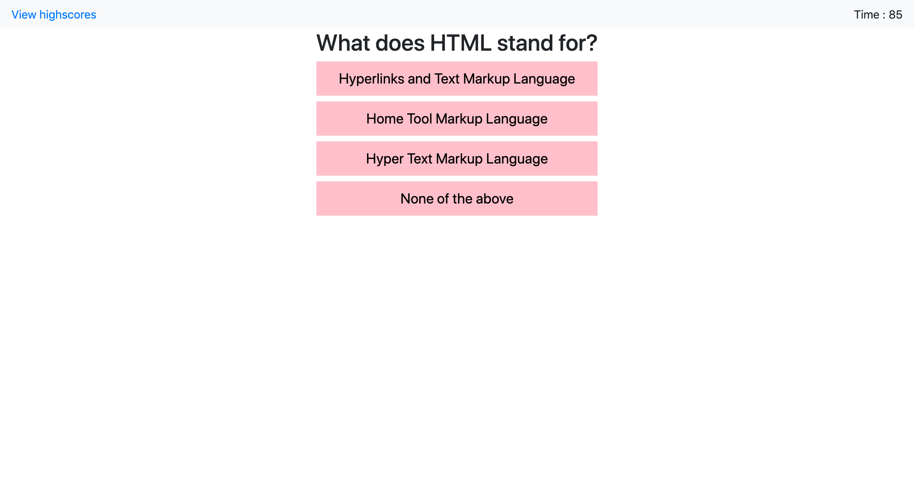

# 04-code-quiz

## Overview

In this project, I bulid a times code quiz app using javascript.This app runs in the browser and feature dynamically updated HTML and CSS powered by JavaScript code. It also features a clean and polished user interface and is responsive, ensuring that it adapts to multiple screen sizes.

## User Story
AS A coding bootcamp student\
I WANT to take a timed quiz on JavaScript fundamentals that stores high scores\
SO THAT I can gauge my progress compared to my peers

## Acceptance Criteria
GIVEN I am taking a code quiz\
WHEN I click the start button\
THEN a timer starts and I am presented with a question\
WHEN I answer a question\
THEN I am presented with another question\
WHEN I answer a question incorrectly\
THEN time is subtracted from the clock\
WHEN all questions are answered or the timer reaches 0\
THEN the game is over\
WHEN the game is over\
THEN I can save my initials and score
 
## The link of the website :

 https://lipaopao010.github.io/04-code-quiz/

 
